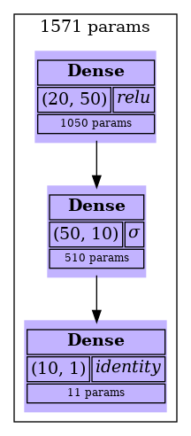
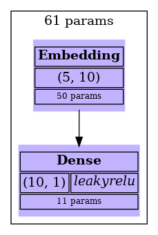
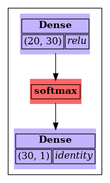
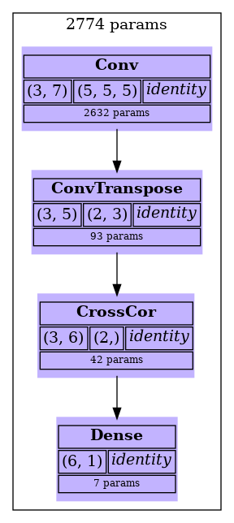
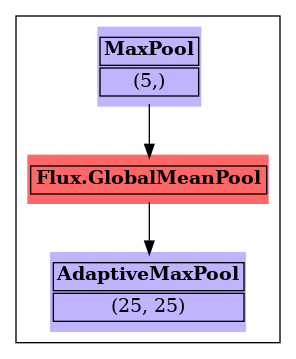
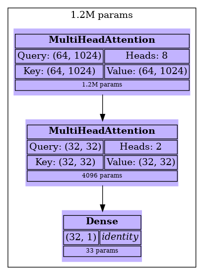
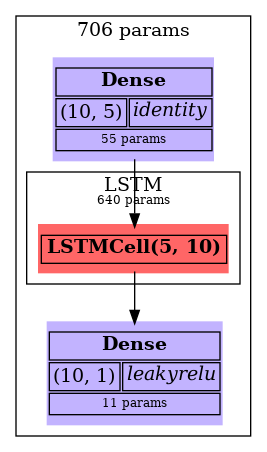
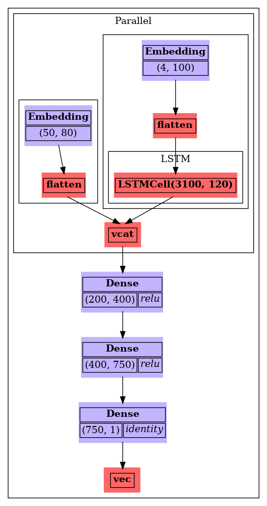

# Dabus
 
A Julia package for visualizing [Flux.jl](https://fluxml.ai/) neural network architectures as GraphViz diagrams.
 

 
---
 
## Installation
 
This package is registered in [LabRegistry](https://github.com/lemieux-lab/LabRegistry)

```julia
# With LabRegistry added in julia registry
] add Dabus

# Otherwise
] add https://github.com/lemieux-lab/Dabus
```
 
Or for local development:
 
```julia
] dev path/to/Dabus
```
 
---
 
## Usage
 
```julia
using Dabus, Flux
 
model = Chain(
    Dense(50, 10, relu),
    Dense(10, 1)
)
 
# Display the network (returns image bytes)
img = draw_network(model)
 
# Save directly to a file
draw_network(model, save_to="network.png")
 
# Export as SVG
draw_network(model, save_to="network.svg", output_type="svg")
```
 
> **Note:** Dabus requires an internet connection. Diagrams are rendered via the [QuickChart.io](https://quickchart.io/) GraphViz API : no local GraphViz installation needed.
 
---
 
## Supported Layer Types
 
| Category | Layers |
|---|---|
| Standard | `Dense`, `Embedding` |
| Convolutional | `Conv`, `ConvTranspose`, `CrossCor` |
| Pooling | `MaxPool`, `MeanPool`, `AdaptiveMaxPool`, `AdaptiveMeanPool`, `GlobalMeanPool` |
| Attention | `MultiHeadAttention` |
| Recurrent | `LSTM`, `GRU` |
| Containers | `Chain`, `Parallel`, `Maxout`, `PairwiseFusion` |
| Skip connections | `SkipConnection` |
| Activations / misc | Any callable (e.g. `relu`, `softmax`, `Flux.flatten`) |
 
---
 
## API Reference
 
### `draw_network(network; save_to=nothing, output_type="png")`
 
Generates a diagram of a Flux neural network.
 
**Arguments:**
- `network` : A Flux model (e.g. a `Chain` or any supported layer).
- `save_to` : Optional file path. If provided, the image bytes are written to this path.
- `output_type` : Output format: `"png"` (default) or `"svg"`.
 
**Returns:** `Vector{UInt8}` : the raw image bytes.
 
---
 
## Examples
 
**Embedding + Dense**
 

 
**Dense + softmax activation**
 

 
**Convolutional layers (Conv, ConvTranspose, CrossCor)**
 

 
**Pooling layers**
 

 
**Multi-head attention**
 

 
**LSTM recurrent network**
 

 
**Complex parallel architecture**
 

 
---
 
## Requirements
 
- Julia ≥ 1.0
- [Flux.jl](https://github.com/FluxML/Flux.jl) ≥ 0.16
- [HTTP.jl](https://github.com/JuliaWeb/HTTP.jl) ≥ 1.0
- Internet connection (diagrams are rendered via the QuickChart.io API)